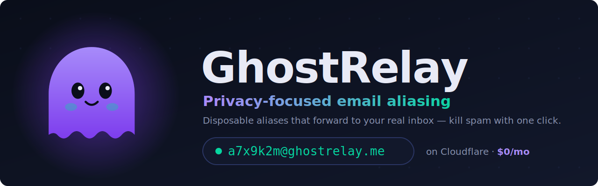

<div align="center">



<br/>
<br/>

**Generate disposable email aliases that forward to your real inbox.**
Protect your identity from spam, breaches, and data brokers — all on infrastructure that costs **$0/month**.

<br/>

**[🌐 Live Demo](https://www.ghostrelay.me)** · **[🚀 Product Hunt](https://www.producthunt.com)** · **[📖 Docs](./CONTEXT.md)** · **[🤝 Contributing](./CONTRIBUTING.md)** · **[🐛 Report Bug](https://github.com/Tech-aficionado/GhostRelay---Open-Source/issues)**

<br/>

[](./LICENSE)
[](./CONTRIBUTING.md)
[](#-tech-stack)
[](https://workers.cloudflare.com/)
[](#-testing)

[](https://nextjs.org/)
[](https://react.dev/)
[](https://www.typescriptlang.org/)
[](https://tailwindcss.com/)

</div>

---

## 📑 Table of Contents

- [Why GhostRelay?](#-why-ghostrelay)
- [How It Works](#-how-it-works)
- [Features](#-features)
- [Tech Stack](#-tech-stack)
- [Quick Start](#-quick-start)
- [Testing](#-testing)
- [Deployment](#-deployment)
- [Architecture](#-architecture)
- [Project Structure](#-project-structure)
- [Roadmap](#-roadmap)
- [Contributing](#-contributing)
- [Security](#-security)
- [License](#-license)

---

## 🤔 Why GhostRelay?

Your email address is the key to your digital identity — and you hand it out
everywhere. Every newsletter, shop, and app becomes another entry in a database
that gets breached, sold, or spammed.

**GhostRelay puts a wall between the world and your real inbox.** Give every
service its own disposable alias. When one starts sending junk, disable it in a
single click — your real address is never exposed.

| Without GhostRelay | With GhostRelay |
|---|---|
| One address everywhere | A unique alias per service |
| Spam floods your inbox | Disable the leaky alias instantly |
| Breaches expose your real email | Breaches only expose a throwaway |
| No idea who sold your data | Each alias tells you exactly who leaked |

> 💡 **100% open source & self-hostable.** Run the whole stack on Cloudflare's
> free tier plus a ~$10/year domain. No vendor lock-in, no subscription.

---

## ⚙️ How It Works

1. **Sign up** with your real email (stored securely, never exposed to senders).
2. **Generate an alias** like `a7x9k2m@ghostrelay.me` — or claim a custom one.
3. **Use it anywhere** — signups, newsletters, shopping, sketchy downloads.
4. **Mail forwards instantly** to your real inbox via Cloudflare + Resend.
5. **Getting spam?** Toggle the alias off, set an expiry, or block the sender.

---

## ✨ Features

**Aliasing**
- 🎭 **Unlimited-style aliasing** — create, label, categorize, enable/disable, delete
- ✍️ **Custom aliases** — claim readable addresses (`shopping@…`) with reserved-word protection
- 🃏 **Wildcard / catch-all** — patterns like `*-shopping` auto-create tracked aliases (scoped to your domain, `*` is the only wildcard)
- ⏳ **Temporary aliases** — auto-expire after N days or N forwarded emails
- 📮 **Multiple destinations** — fan one alias out to several inboxes

**Deliverability & insight**
- 📊 **Analytics dashboard** — forwarding trends, top senders, bounce rates
- 📜 **Activity logs** — see who emailed which alias and when
- 🚫 **Sender blocklist** — block specific senders per alias
- 📉 **Bounce & complaint tracking** — Resend webhook integration with auto-disable on repeated hard bounces

**Platform**
- 🧩 **Browser extension** — one-click alias generation and signup-form autofill (Chrome/Edge/Firefox)
- 📱 **PWA** — installable, offline-capable, push notifications on new forwards
- 🔐 **2FA & session management** — device-aware sessions with revocation
- 🛡️ **Security hardened** — CORS allowlist, security headers, HMAC tokens, per-endpoint rate limiting

---

## 🧱 Tech Stack

| Layer | Technology | Cost |
|-------|-----------|------|
| Frontend | Next.js 16 · React 19 · Tailwind v4 · TypeScript | Free (Vercel / CF Pages) |
| Backend | Cloudflare Worker (ES modules) | Free tier |
| Database | Cloudflare D1 (SQLite at the edge) | Free tier |
| Email routing | Cloudflare Email Routing | Free |
| Email sending | Resend (SPF · DKIM · DMARC) | Free tier |
| Auth | HMAC access + refresh tokens · optional Firebase (Google) | — |
| Domain | your `.me`/`.com` | ~$10/year |

**Total running cost: `$0/month`** (excluding the domain).

---

## 🚀 Quick Start

```bash
# Clone
git clone https://github.com/Tech-aficionado/GhostRelay---Open-Source.git
cd GhostRelay---Open-Source

# 1) Frontend
cd frontend
npm install
npm run dev            # → http://localhost:3000

# 2) Backend (in a second terminal)
cd worker
npm install
npx wrangler d1 execute ghostrelay-db --local --file=../database/schema.sql
npx wrangler dev       # → http://localhost:8787
```

> The frontend runs in **demo mode** (localStorage) when no backend is
> reachable, so you can preview the UI instantly with zero setup.

---

## 🧪 Testing

Core worker logic (wildcard matching, alias deliverability) is covered by a unit
suite running on **Node's built-in test runner** — no extra dependencies.

```bash
cd worker
npm test               # runs `node --test`  →  15 passing
```

---

## ☁️ Deployment

```bash
# Worker (edit wrangler.toml [vars]: EMAIL_DOMAIN, ORG_FORWARD_TO)
cd worker
npx wrangler secret put JWT_SECRET
npx wrangler secret put RESEND_API_KEY
npx wrangler deploy

# Frontend
cd frontend
npx vercel --prod
# Set NEXT_PUBLIC_API_URL in Vercel project settings
```

Point **Cloudflare Email Routing → Catch-all → Send to Worker** at your domain to
start receiving mail. Full DNS/SPF/DKIM steps live in
[`docs/SETUP-SPF-DKIM.md`](./docs/SETUP-SPF-DKIM.md).

---

## 🏗️ Architecture

```
Browser / Extension
       │
       ▼  REST API (HTTPS)
┌──────────────────────┐
│  Cloudflare Worker    │◄── Email Routing (catch-all)
│  - Auth (HMAC + 2FA)  │
│  - Alias CRUD         │
│  - Email forwarding   │──► Resend (SPF/DKIM/DMARC) ──► your inbox
│  - Webhooks / bounces │
└─────────┬────────────┘
          │ D1 Binding
          ▼
┌──────────────────────┐
│  Cloudflare D1        │
│  (SQLite at the edge) │
└──────────────────────┘
```

See [`CONTEXT.md`](./CONTEXT.md) for the full data model and API reference.

---

## 📂 Project Structure

```
├── assets/            Brand assets (banner)
├── frontend/          Next.js 16 app (TypeScript)
├── worker/            Cloudflare Worker backend + tests
├── database/          SQL schema and migrations
├── extension/         Browser extension (Chrome/Edge/Firefox)
└── docs/              Setup guides (SPF/DKIM, advanced features)
```

---

## 🗺️ Roadmap

- [x] Custom, wildcard, and temporary aliases
- [x] Analytics, activity logs, and bounce tracking
- [x] Browser extension + PWA with push notifications
- [x] 2FA and device-aware session management
- [x] Automated worker test suite
- [ ] Reply-from-alias support (outbound relay)
- [ ] Team / shared-domain workspaces
- [ ] Import/export aliases (CSV / JSON)
- [ ] Self-host one-click deploy template

Have an idea? [Open an issue](https://github.com/Tech-aficionado/GhostRelay---Open-Source/issues) 🙌

---

## 🤝 Contributing

Contributions are welcome and appreciated! Please read
[CONTRIBUTING.md](./CONTRIBUTING.md) for setup, project layout, and the pull
request workflow.

1. Fork the repo and create your branch: `git checkout -b feature/amazing-thing`
2. Make your changes and run `npm test` in `worker/`
3. Commit with a clear message and open a PR against `main`

> 🔒 Never commit secrets — document new environment variables in the relevant
> `.env.example` file.

---

## 🛡️ Security

Auth uses short-lived HMAC access tokens with rotating refresh tokens, per-user
salted password hashing, timing-safe comparisons, rate limiting, and strict CORS
+ security headers. Found a vulnerability? Please **open a private security
advisory** rather than a public issue.

---

## ⭐ Support

If GhostRelay is useful to you, **star the repo** — it genuinely helps others
discover the project and keeps the ghost happy. 👻

---

## 📄 License

Released under the [MIT License](./LICENSE). Free to use, modify, and self-host.

<div align="center">
<br/>
<sub>Built with 👻 on the edge · <a href="https://www.ghostrelay.me">ghostrelay.me</a></sub>
</div>
